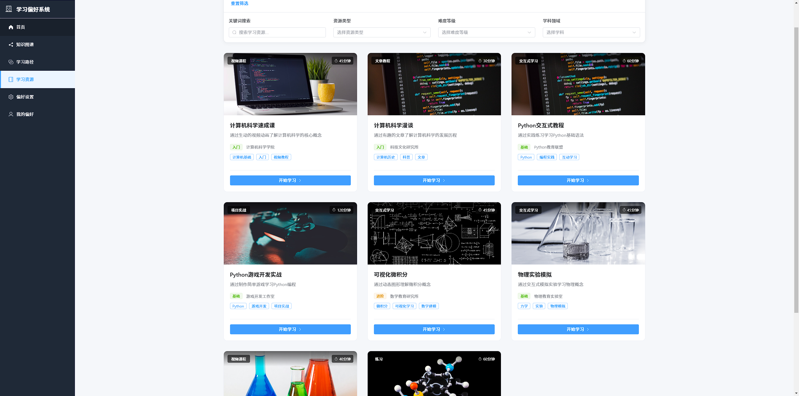

# 基于学习偏好的大学生个性化学习资源构建（知识图谱） 🌟

一个智能的个性化学习平台，基于用户的学习偏好推荐定制化的学习路径和资源。

### 项目截屏




## 🌟 主要特性

### 学习偏好管理 🎯
- 支持多维度学习风格评估
- 可视化学习偏好设置与卡片式布局展示
- 学习偏好历史记录
- 实时偏好更新

### 智能资源推荐 📚
- 基于学习风格的资源匹配
- 多样化的学习资源类型
  - 视频课程 🎥
  - 文章教程 📝
  - 测试题 ✍️
  - 练习题 📋
  - 项目实战 💻
  - 交互式学习 🤝
  - 电子书 📖
  - 系统课程 📑
- 智能难度适配
- 个性化推荐原因

### 学习路径设计 🗺️
- 预设多种学习方向（前端开发、人工智能、数据分析、后端开发）
- 精美卡片式路径展示，配有渐变背景
- 个性化学习路径定制
- 基于用户偏好的路径推荐

### 知识图谱可视化 🔍
- 可视化学习路径
- 智能路径生成
- 前置知识关联
- 学习进度追踪
- 节点交互与高亮功能

### 用户界面 💫
- 响应式设计
- 现代化卡片布局
- 动态渐变背景
- 流畅的交互体验和过渡效果
- 直观的资源展示

## 🛠️ 技术栈

- 🖥️ 前端框架：Vue 3 + TypeScript
- 🎨 UI组件：Element Plus
- 🎯 状态管理：Pinia
- 🚦 路由管理：Vue Router
- 💅 样式工具：Tailwind CSS
- 📊 可视化：D3.js
- 🔧 构建工具：Vite

## 📦 项目结构

```
src/
├── components/        # 组件
├── views/            # 页面
├── stores/           # 状态管理
├── types/            # 类型定义
├── router/           # 路由配置
└── assets/           # 静态资源
```

## 🚀 快速开始

1. 进入项目 
```bash
learner-preference-knowledge-graph
```

2. 安装依赖
```bash
npm install
```

3. 启动开发服务器
```bash
npm run dev
```

## 📱 功能预览

### 个性化学习路径
- 预设学习方向选择
- 基于用户偏好的路径定制
- 精美卡片布局与渐变背景
- 直观的学习步骤展示

### 学习偏好展示
- 卡片式布局展示用户偏好
- 分页式偏好管理
- 视觉化的学习风格展示
- 偏好详情一目了然

### 知识图谱可视化
- 交互式节点展示
- 智能关系连接
- 缩放与平移功能
- 节点聚焦与相关内容高亮

### 学习资源推荐
- 基于节点的资源展示
- 资源类型可视化标识
- 匹配度评分
- 个性化学习建议

